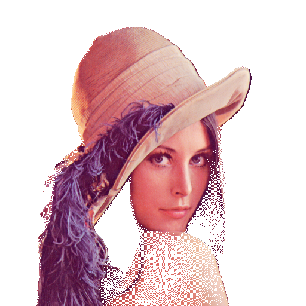

# Free Background Remover: Node.js Library for Background Removal

Free Background Remover is a Node.js library designed to remove backgrounds from images using an ONNX model. The library provides a streamlined pipeline for preprocessing images, predicting masks, post-processing the masks, and generating images without backgrounds.  No API Keys needed.

## Features

- Supports multiple dithering methods for mask post-processing.
- Handles batch processing of images from a specified input directory.
- Outputs images with removed backgrounds to a specified directory.
- Optionally saves the generated masks for further use.

## Installation

To install Free Background Remover, you need to clone the repository and install the dependencies:

```bash
npm install free-background-remover
```

## Usage

### Basic Usage

Here's an example of how to use Free Background Remover to remove the background from images in a directory:

```javascript
const BGRMPipeline = require('./index');

const pipeline = new BGRMPipeline({
  onnxModel: "./u2netp.onnx", // Path to your ONNX model
  dither: BGRMPipeline.NATIVE_DITHER // Dithering method
});

const inputPath = "path/to/your/images/*.jpg";
const outputPath = "path/to/output/images";
const outputMasksPath = "path/to/output/masks"; // Optional

pipeline.run(inputPath, outputPath, outputMasksPath)
  .then(() => {
    console.log("Background removal process completed.");
  })
  .catch((error) => {
    console.error("An error occurred:", error);
  });
```

### Configuration Options

- **onnxModel**: Path to the ONNX model file. Default is `./u2netp.onnx`.
- **dither**: Dithering method for post-processing masks. Options are:
  - `BGRMPipeline.FLOYD_STEINBURG_DITHER`
  - `BGRMPipeline.NO_DITHER`
  - `BGRMPipeline.NATIVE_DITHER` (default)

## API

### BGRMPipeline

#### Constructor

```javascript
new BGRMPipeline(options)
```

- **options**: An object containing configuration options.
  - **onnxModel**: Path to the ONNX model file.
  - **dither**: Dithering method for post-processing masks.

#### Methods

##### run(inputPath, outputPath, outputMasksPath)

Processes images to remove backgrounds.

- **inputPath**: Glob pattern specifying the input image files.
- **outputPath**: Directory where the output images with removed backgrounds will be saved.
- **outputMasksPath**: (Optional) Directory where the generated masks will be saved.

## ONNX and U^2-Net Model

### ONNX

ONNX (Open Neural Network Exchange) is an open format built to represent machine learning models. ONNX allows models to be transferred between different frameworks, providing interoperability in the AI community.

### Limitations of U^2-Net Models

The U^2-Net model used in this library generates masks at a resolution of 320x320 pixels. This means that while the model is effective at removing backgrounds, the resulting mask resolution might not match the original image resolution, potentially leading to some loss of detail in the final output.

## Example

Here's an example script to remove backgrounds from images in the `input` directory and save the results to the `output` directory:

```javascript
const BGRMPipeline = require('./index');

const pipeline = new BGRMPipeline({
  onnxModel: "./u2netp.onnx",
  dither: BGRMPipeline.NATIVE_DITHER
});

pipeline.run("input/*.jpg", "output", "masks")
  .then(() => {
    console.log("Background removal process completed successfully.");
  })
  .catch((error) => {
    console.error("An error occurred during the background removal process:", error);
  });
```

## Examples Using Lenna

Here are examples of using the Free Background Remover with the image "Lenna".

### Original Image


### Background Removed with Native Dithering


### Background Removed with Floyd-Steinberg Dithering



### Background Removed with No Dithering


## License

This project is licensed under the ISC License. See the LICENSE file for more details.

## Acknowledgements

This library utilizes the U^2-Net model for background removal. Special thanks to the authors of U^2-Net and the open-source community.

---

Feel free to contribute to the project or report any issues on the [GitHub repository](<repository-url>).